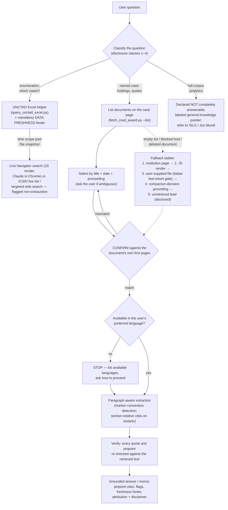

# ISDS Research skill (Track 1)

This is a retrieval-grounded research aid for investor-State dispute settlement (ISDS) awards. It answers questions on investment dispute cases and topics by retrieving **primary documents on demand** from ICSID, PCA, and other official sources to ground answers in the actual award text, with pinpoint (paragraph / page) citations. It complies with the terms of the public databases on which it relies; it never scrapes or hosts a corpus, and it cites only text it actually retrieved.

**Not legal advice.**

## How to install in Claude

1. **Download the skill.** Download the packaged ZIP file here: https://github.com/ccrnyc/isds-research/releases/latest/download/isds-research.zip (alternatively, download from this repo's [Releases page](../../releases)).
2. **Ensure "Cloud code execution and file creation" is enabled so skills can run**. On Free/Pro/Max plans: go to Settings > Capabilities > and make sure "Cloud code execution and file creation" is turned on. On Team/Enterprise plans: your organization Owner enables Skills under Organization settings > Skills.
3. **Upload the skill.** Go to Customize > Skills, click "+" or "Add"  → "Upload a skill", and select the ZIP. Select the skill and toggle it on.

To use the skill, just ask an ISDS question — e.g. *"How did the tribunal in Tecmed v. Mexico articulate the fair and equitable treatment standard?"* Claude will invoke the skill automatically.

For full functionality, see **Network requirements** below.

## What's here

- `SKILL.md` — the agent skill: workflow, compliance guardrails, attribution/disclaimer, and the golden rule (ground, don't recall).
- `WRITEUP.md` — design notes: why it's built this way, how it was evaluated (10-item adjudicated eval; version 1.0 graded overall A−), and the *Saluka*→*Methanex* phantom-citation finding.
- `scripts/fetch_icsid_award.py` — lists the documents on an ICSID case page, downloads the one you select, shows its first page(s) so you can confirm it is the right document, then extracts paragraph-aware text (full PDF, no truncation), with optional query matching. Handles both paragraph-marker conventions (`154. ` and bracketed `[324] `, auto-detected) and per-Part/Chapter numbering restarts (e.g. Methanex): heading-confirmed restarts yield section-relative cites ("PART IV - CHAPTER D, para 7"); unrecognized numbering conventions trigger an explicit warning to fall back to page-based cites.
- `scripts/query_unctad_excel.py` — filters the local UNCTAD full-data Excel snapshot (`data/`) for "which cases" questions: any combination of respondent, treaty, outcome, breach, sector, rules, year, arbitrator, free text; extracts ICSID case numbers (they live inside the case-name/link text, not a dedicated column); flags rows whose snapshot data is presumptively stale (`LIVE_CHECK`: pending at snapshot, follow-on pending, or recent activity); and appends a mandatory data-freshness footer (snapshot date, UNCTAD's non-exhaustive caveat, and a throttled ≤1×/day live check of the Navigator's "Updated as of" date, degrading to "last known" when offline).
- `data/` — where **your own copy** of UNCTAD's official full-data Excel lives (1,332 cases in the 31/12/2023 release; the live Navigator runs ~2 years ahead of it). **The file is not included in this repo** — UNCTAD's terms bar redistribution; see the download section below. Used locally for non-commercial filtering only, never republished.

## Get the UNCTAD data (required, one download)

The skill's "which cases…" (enumeration) features run on UNCTAD's official full-data Excel, which is **not included in this repo**: UNCTAD's [Terms of Use](https://investmentpolicy.unctad.org/pages/1048/terms-and-conditions-of-use) permit personal, non-commercial use but bar redistribution, so each user downloads their own copy directly from UNCTAD (free, no registration):

1. Check UNCTAD's [release page](https://investmentpolicy.unctad.org/publications/1303/investment-dispute-settlement-navigator-full-isds-data-release-as-of-31-12-2023-in-excel-format-) for the full-data release; as of this writing the latest is the **31/12/2023 snapshot**: [direct download](https://investmentpolicy.unctad.org/uploaded-files/document/UNCTAD-ISDS-Navigator-data-set-31December2023.xlsx).
2. Put the `.xlsx` in this skill's `data/` folder. In a Claude chat (Cowork / claude.ai), you can simply **upload the file to Claude and ask it to save it into the skill's `data/` folder** — Claude will then reuse it in later sessions without re-uploading.

If you run the skill without the file, `query_unctad_excel.py` prints these same instructions (`DATA_MISSING`) instead of failing cryptically. Award retrieval (`fetch_icsid_award.py`) works without the Excel; only enumeration needs it.

## Install & run

```
pip install requests pdfplumber openpyxl

# (first run) record your preferred language, asked once
python scripts/fetch_icsid_award.py --set-prefer-lang "English"

# 1) list every document on the case page (proceeding, title, date, languages)
python scripts/fetch_icsid_award.py --case "ARB(AF)/00/2" --list

# 2) select one, confirm it from its first page, and search it
python scripts/fetch_icsid_award.py --case "ARB(AF)/00/2" --select 1 --query "fair and equitable treatment"
```

Step 2 prints a CONFIRM block (case-page label, detected case number, first-page text) so you can verify the document before relying on it, then the matching passages with `para N (p.M)` citations, plus the required ICSID attribution and a not-legal-advice disclaimer.

**Language** is treated as an attribute, not a filter: awards available only in Spanish/French/etc. are valid results. The tool retrieves your preferred language when it exists; when it doesn't, it does not silently substitute — it lists the languages the document *is* available in and asks how you want to proceed (read an existing ICSID version, or get a flagged, non-authoritative translation of the original), because the page doesn't always establish which language is authoritative. Supply the choice with `--select N --lang "<language>"`.

## Network requirements

The scripts fetch documents and metadata directly, so the environment running them needs outbound access to these official hosts:

- `icsid.worldbank.org` — case-detail pages
- `icsidfiles.worldbank.org` — the document PDFs
- `investmentpolicy.unctad.org` — your own download of the UNCTAD Excel, and the helper's freshness check
- `pca-cpa.org` / `docs.pca-cpa.org` — PCA case pages and documents

**italaw is deliberately not on this list.** The default route for italaw documents is you downloading them manually in your browser (see Compliance notes) — the tool needs no italaw network access unless you explicitly approve the gated, per-document fallback.

**Please add these sites to your allow list to use the tool's full functionality.**

- **claude.ai / Cowork on Team or Enterprise plans:** network access is controlled by your organization Owner. If the scripts report blocked hosts, discuss with the Owner whether these domains can be added to the allow list (or network access enabled).
- **Claude Code:** approve the per-domain network prompts on first use, or pre-allow the hosts under `sandbox.network.allowedDomains` in your `settings.json`.

Any settings change is yours to make — the skill never modifies your settings. These domains govern the skill's *scripts*; Claude's built-in web fetch and the optional Claude in Chrome are governed separately by your Claude settings.

## Discovery & data freshness (graceful degradation)

"Which cases…" questions follow a **discovery ladder** — each rung degrades gracefully to the next, and the answer always discloses which rung it stands on:

1. **Local UNCTAD Excel** (`scripts/query_unctad_excel.py`) — the complete, filterable set of UNCTAD-tagged cases up to the snapshot date (currently 31/12/2023). Primary and sufficient for questions bounded by the snapshot.
2. **Live Navigator search** — for the recency window after the snapshot. The Navigator's search/list views are JS-rendered, so this rung requires a JS-capable browser render: **Claude in Chrome is an optional prerequisite** (install: https://code.claude.com/docs/en/chrome). Targeted searches only; never bulk-crawled.
3. **Without Chrome** — the skill does *not* fail or fake completeness: it supplements with ICSID's own live case database (server-rendered) for the ICSID subset and/or targeted web search, expressly flagged as non-exhaustive pointers rather than a complete set.

Named-case lookups never need a browser: individual Navigator case pages are server-rendered and resolve by numeric id (`/investment-dispute-settlement/cases/{id}/{any-slug}`). Note the freshness layers: Excel snapshot (31/12/2023) < live Navigator (itself a ~biannual snapshot; currently 31/12/2025) < the institutions' own live pages (ICSID/PCA) — truly current status comes only from the last layer. The helper's `LIVE_CHECK` flag marks rows whose snapshot data is presumptively stale; its freshness check requires outbound network (works on a normal machine / Claude Code; some sandboxes block it, in which case it reports "NOT verified now" and continues).

## Design (the RAG pipeline)



1. **Discovery** — the ladder above: local UNCTAD Excel → JS-rendered Navigator search (Claude in Chrome) → ICSID live list / targeted web search with disclosed limits. ICSID's own case database (permissive robots) for ICSID cases; never bulk-harvested.
2. **Identify** — fetch the ICSID case-detail page and parse *all* published documents into a structured table (proceeding, title, date, and every available language + URL), rather than grabbing "the first English PDF".
3. **Confirm** — download the selected document and read its first page(s) to verify title, parties, case number, and date match the intended document before relying on it.
4. **Extract** — pdfplumber, page-by-page, detecting paragraph numbers so answers carry pinpoint cites (full PDF, no truncation).
5. **Ground** — answer only from retrieved text; if a point isn't there, say so.
6. **Verify** — confirm every quote/paragraph appears in the retrieved text before sending.

## What this tool does well and does not do

**Does well:** verifiable research. Single-document questions ("how did *Tecmed* treat proportionality?") get pinpoint-cited answers grounded in the confirmed primary text. Bounded comparisons ("compare X, Y, Z on topic A") get the same, plus a required completeness check that flags — as expressly unexamined leads — any other cases or lines of authority a full treatment of the topic would need. Category enumeration ("which treaty cases arose from the Venezuelan nationalizations?") runs on UNCTAD's official dataset with its scope and snapshot date disclosed.

**Deliberately does not:** corpus analytics. There is no scraped award corpus here (by design — see Compliance notes) and no access to subscription databases (Investor-State LawGuide, Jus Mundi, italaw full-text). So questions like "the most-cited case on topic Z" or "how often does arbitrator N dissent" cannot be answered completely; the tool says so, offers a clearly-labeled general-knowledge pointer, and refers the user to the databases built for that job. The tool is designed to be honest about its limits: every answer states what was actually examined and what wasn't.

## Compliance notes

- **ICSID** Terms permit viewing/downloading for personal, non-commercial use; no redistribution or derivative database. Attribution required (the script emits it).
- **UNCTAD** is discovery/metadata only; its robots blocks bulk/training crawlers and its Terms bar compiling/redistributing its dataset — so it is used human-directed or via targeted `Claude-User` fetches, never bulk-harvested.
- **italaw** is a **last-resort, per-case-confirmed fallback only**: official sources (ICSID/PCA) first; the default route is the user downloading the document manually (italaw's Terms expressly permit manual browsing); an automated fetch happens only with per-document human confirmation, as Claude-User, one document per approval, reference-don't-reproduce, and logged. italaw content never enters any build/test corpus. See the italaw entry in SKILL.md for the full conditions.
- Polite access: descriptive User-Agent, courtesy delay between requests, single-document on-demand only.

## License

Copyright (C) 2026 Cameron Russell (ccrnyc). Licensed under the **GNU Affero General Public License v3.0** (`AGPL-3.0-only`) — see [LICENSE](LICENSE). This program comes with ABSOLUTELY NO WARRANTY. The license covers the skill's code and documentation only; retrieved documents and the UNCTAD dataset remain governed by their own sources' terms (see Compliance notes).

## Known constraints

- `web_fetch` (the no-code fallback) truncates very long PDFs at ~120k characters, which silently drops the later paragraphs of a long award — a holding deep in the document simply vanishes from view. The script avoids this by downloading the file and extracting with pdfplumber — run it where the host (`icsidfiles.worldbank.org`) is reachable. Note `icsidfiles.worldbank.org` returns 403 on a bare-domain request but serves real PDF paths normally; some sandboxes block the host at the network proxy, in which case run locally or in a network-capable environment.
- ICSID case-detail pages are inconsistently rendered per case: most carry the document links in the initial HTML (plain `requests` sees them), but some inject the list client-side. When the document list comes back empty, the skill does not guess — it diagnoses the cause and falls back to a JS-capable render or asks for the document URL (see the retrieval fallback ladder in SKILL.md).
